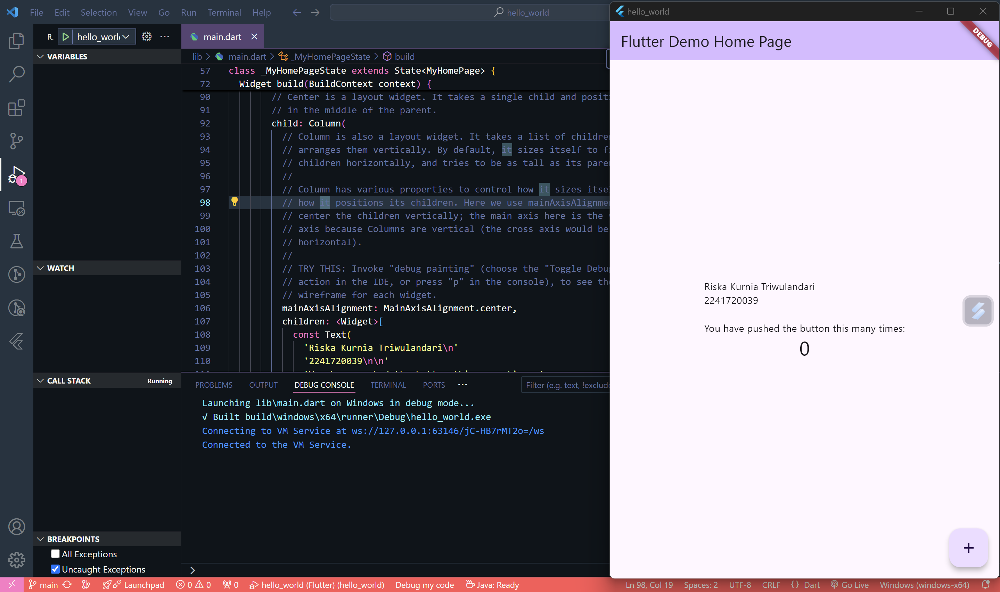
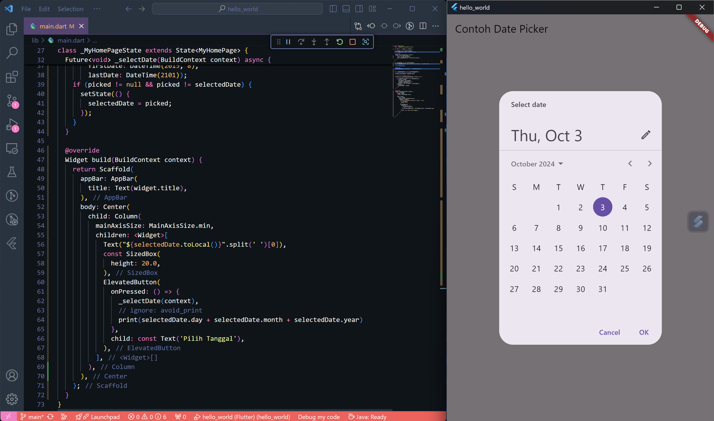

# hello_world

A new Flutter project.

---
### Tugas Praktikum
1. Selesaikan Praktikum 1 sampai 5, lalu dokumentasikan dan push ke repository Anda berupa screenshot setiap hasil pekerjaan beserta penjelasannya di file README.md!
2. Selesaikan Praktikum 2 dan Anda wajib menjalankan aplikasi hello_world pada perangkat fisik (device Android/iOS) agar Anda mempunyai pengalaman untuk menghubungkan ke perangkat fisik. Capture hasil aplikasi di perangkat, lalu buatlah laporan praktikum pada file README.md.
3. Pada praktikum 5 mulai dari Langkah 3 sampai 6, buatlah file widget tersendiri di folder basic_widgets, kemudian pada file main.dart cukup melakukan import widget sesuai masing-masing langkah tersebut!
4. Selesaikan Codelabs: Your first Flutter app, lalu buatlah laporan praktikumnya dan push ke repository GitHub Anda!
5. README.md berisi: capture hasil akhir tiap praktikum (side-by-side, bisa juga berupa file GIF agar terlihat proses perubahan ketika ada aksi dari pengguna) dengan menampilkan NIM dan Nama Anda sebagai ciri pekerjaan Anda.
6. Kumpulkan berupa link repository/commit GitHub Anda kepada dosen yang telah disepakati!

### Jawab

## Praktikum 1: Membuat Project Flutter Baru
- Langkah 1
Untuk menampilkan Command Palette tekan tombol Ctrl + Shift + P kemudian ketik Flutter.

Pilih Application yang fungsinya membuat proyek Flutter baru dengan template aplikasi yang lengkap.

- Langkah 2
Membuat folder sesuai style laporan praktikum. Lalu pilih Select a folder to create the project in.

- Langkah 3
Membuat nama project flutter hello_world.

- Langkah 4
Jika sudah selesai proses pembuatan project baru, pastikan tampilan seperti berikut. 

## Praktikum 2: Menghubungkan Perangkat Android atau Emulator
- Langkah 1
Untuk bisa menghubungkan perangkat android ke menggunakan USB atau Wireless untuk debug. 
- Langkah 2
Buka Opsi Pengembang dan aktifkan debug menggunakan USB.

- Langkah 3
Setelah itu akan muncul pesan peringatan mengenai izin untuk debugging menggunakan USB. Pengguna harus mengizinkan untuk bisa lanjut ke proses berikutnya.

- Langkah 4
Pastikan download Google USB Driver pada Android Studio pada bagian SDK Tools.
- Langkah 5
Klik Buka untuk menampilkan hello_world.

Tampilan bahwa berhasil connect.

- Langkah 6
Pilih Device yang digunakan.

- Langkah 7
Lakukan flutter run untuk menjalankan kode.

- Langkah 8
Tampilan jika berhasil.

## Praktikum 3: Membuat Repository GitHub dan Laporan Praktikum
- Langkah 1
Membuat repository baru dengan nama "flutter-fundamental-part1"

- Langkah 2
Lalu klik tombol "Create repository" lalu akan tampil seperti gambar berikut.

- Langkah 3
Buka terminal lalu ketik "git init", ini berfungsi untuk membuat repositori Git baru atau mengonversi proyek yang sudah ada ke repositori Git.

- Langkah 4
Pilih menu Source Control di bagian kiri, lalu lakukan stages (+) pada file .gitignore untuk mengunggah file pertama ke repository GitHub.

- Langkah 5
Beri pesan commit "tambah gitignore" lalu klik Commit (✔)

- Langkah 6
Lakukan push dengan klik bagian menu titik tiga > Push

- Langkah 7
Di pojok kanan bawah akan tampil seperti gambar berikut. Klik "Add Remote"

- Langkah 8
Salin tautan repository Anda dari browser ke bagian ini, lalu klik Add remote

Setelah berhasil, tulis remote name dengan "origin"

- Langkah 9
Tampilan setelah push kedua file.
 
- Langkah 10
Lakukan push juga untuk semua file lainnya dengan pilih Stage All Changes. 
 
- Langkah 11
ubah platform di pojok kanan bawah ke emulator atau device atau bisa juga menggunakan browser Chrome. 
 
- Langkah 12
 

## Praktikum 4: Menerapkan Widget Dasar
- Langkah 1: Text Widget
Buat folder baru basic_widgets di dalam folder lib dan buat file dengan nama text_widget.dart. Fungsi dari Text Widget di Flutter adalah untuk menampilkan teks di layar. 
 
 
- Langkah 2: Image Widget
untuk membuat widget yang menampilkan gambar dalam aplikasi Flutter. 
 
Lakukan penyesuaian asset pada file pubspec.yaml dan tambahkan file logo Anda di folder assets project hello_world.
 
Tampilan
 

## Praktikum 5: Menerapkan Widget Material Design dan iOS Cupertino
- Langkah 1: Cupertino Button dan Loading Bar
Buat file di basic_widgets>loading_cupertino.dart.
 
Kode tersebut bertujuan untuk menampilkan Cupertino Button dan Loading Bar (CupertinoActivityIndicator) di aplikasi Flutter dengan gaya tampilan iOS (Cupertino). 
 

- Langkah 2: Floating Action Button (FAB)
 
Kode tersebut bertujuan untuk menampilkan sebuah Floating Action Button (FAB) di aplikasi Flutter. Floating Action Button adalah sebuah tombol melayang (floating) yang biasanya digunakan untuk tindakan utama dalam sebuah layar.
 

- Langkah 3: Scaffold Widget
Scaffold widget digunakan untuk mengatur tata letak sesuai dengan material design.
 
 

- Langkah 4: Dialog Widget
Dialog widget pada flutter memiliki dua jenis dialog yaitu AlertDialog dan SimpleDialog.
a. AlertDialog
digunakan untuk menampilkan pesan yang membutuhkan interaksi dari pengguna, biasanya berisi teks yang menjelaskan situasi tertentu dan pilihan aksi seperti "OK" atau "Cancel."
 
b. SimpleDialog 
digunakan ketika aplikasi ingin menampilkan pilihan atau opsi kepada pengguna, biasanya dalam bentuk daftar pilihan. SimpleDialog lebih fokus pada pilihan daripada tindakan.
 
 

- Langkah 5: Input dan Selection Widget
Flutter menyediakan widget yang dapat menerima input dari pengguna aplikasi yaitu antara lain Checkbox, Date and Time Pickers, Radio Button, Slider, Switch, TextField.
 
 

- Langkah 6: Date and Time Pickers
 
Setelah menekan tombol Pilih Tanggal
 
Setelah memilih salah satu tanggal
 
Jadi, kode tersebut menciptakan aplikasi sederhana yang memungkinkan pengguna untuk memilih tanggal dari dialog Date Picker. Setelah memilih tanggal, tanggal yang dipilih akan ditampilkan di layar.